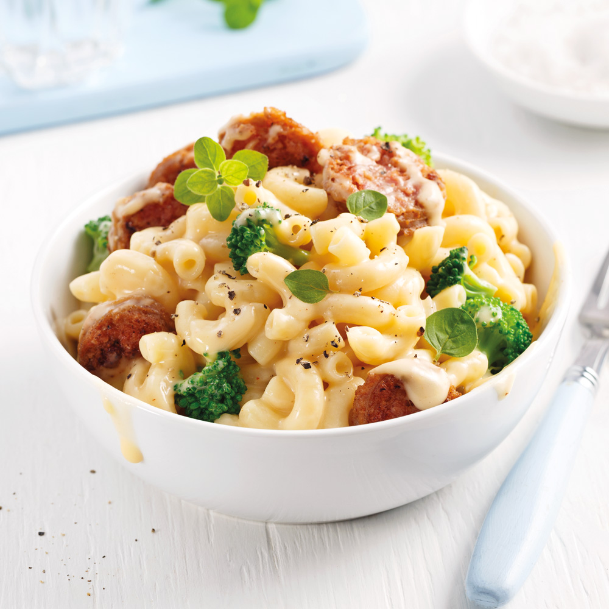

# Recette-Kraft-Dinner-Saucisse

## Titre 1
Ingédients

1. Pâte
2. Beurre
3. Fromage mozzarella
4. Fromage Monterijack
5. Saucisse
6. Brocolis
7. Lait

## Titre2
1. Faire bouillir de l'eau.
2. Mettre les pâtes dans l'eau.
3. Égoutter les pâtes.
4. Dans une casserole rajouter beure,lait,fromages et pâtes.
5. Dans une poêle, mettre les saucisses.
6. Quand les saucisses sont cuites, ajouter les saucisses et les brocolis dans la casserole.
7. Déguster !

